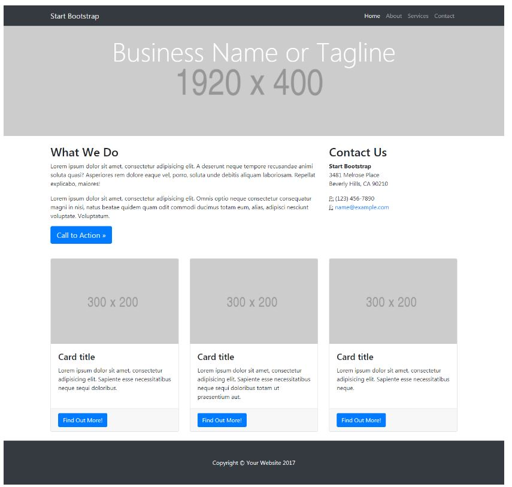
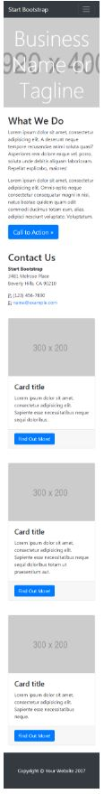

# Mi página

* **Track:** _Common Core_
* **Curso:** _Crea tu propia red social_
* **Unidad:** _La web desde un móvil_

***
## Objetivo
---
El reto consiste en realizar una página web responsive con un grid para desktop y mobile. La página debe verse así, respectivamente:

## Contenido

Este proyecto contiene:

1. Un archivo `index.html` que contiene la estructura inicial de la página web. Este debe contener las siguientes secciones para la versión desktop:

  * Un encabezado con opciones de navegación que contempla, a la izquierda, un título y, a la derecha, un menú con cuatro opciones. Este encabezado es de fondo plomo oscuro y letras blancas.
  * Una sección que contendrá el título de la página y las dimensiones de la imagen que albergará.
  * Una sección con información de la página, dividida en dos columnas: en la primera a la izquierda, se encuentra un subtítulo, dos párrafos y un botón de fondo azul y letras blancas, y en la segunda a la derecha, se encuentra un subtítulo, debajo del que se encuentra otro subtítulo y cinco párrafos de información de contacto.
  * Una sección con tres bloques que se dividen en tres partes: las dimensiones de la imagen que contendrán, con un fondo plomo, un subtítulo y un párrafo, y un botón de fondo azul y letras blancas.
  * Un pie de página con el Copyright de la página web y el año, con un fondo plomo oscuro y letas blancas.

  Las secciones para la versión mobile son las siguientes:
  * Un encabezado con opciones de navegación que contempla, a la izquierda, un título y, a la derecha, un menú de hamburguesa. Este encabezado es de fondo plomo oscuro y letras blancas.
  * Una sección que contendrá el título de la página y, detrás de este, las dimensiones de la imagen que albergará.
  * Un subtítulo, dos párrafos con información de la página y un botón de fondo azul y letras blancas.
  * Un subtítulo, debajo del que se encuentra otro subtítulo y cinco párrafos de información de contacto.
  * Tres bloques uno debajo del otro que abarcan tres partes: las dimensiones de la imagen que contendrán, con un fondo plomo, un subtítulo y un párrafo, y un botón de fondo azul y letras blancas.
  * Un pie de página con el Copyright de la página web y el año, con un fondo plomo oscuro y letas blancas.

2. Una carpeta `assets` donde se encuentra la carpeta `docs` que contiene la imagen en formato ***jpg*** de la página web a replicar en sus versiones desktop y mobile.

3. Una carpeta `css` que contiene un archivo `main.css` donde hay clases reutilizables y específicas para darle estilo a la página web.

4. Un archivo  **`README.md`** que explica el contenido del repositorio.

## Autora
Lizbeth Félix Peña

## Fecha
09/12/2017
